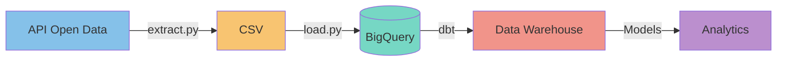

# 🚧 Travaux Angers ELT Pipeline

## 🎯 Vue d'ensemble

SITUATION :
Dans un contexte de transition vers une culture data-driven l’entreprise commençait à s’appuyer davantage sur ses données pour prendre des décisions. Elle voulait mettre en place une modern data stack afin de mieux exploiter ses données. Ce projet visait à simuler l’intervention d’un data engineer chargé de concevoir une architecture fiable et automatisée pour le traitement des données internes.

TÂCHE :
Conception d’un pipeline ELT et d’une data warehouse avec architecture Médaillon sous BigQuery/dbt, garantissant des données de qualité et fiables pour l’analytics sur les travaux publics de la Ville d’Angers.

ACTION :
• Implémenté trois scripts Python pour automatiser le pipeline de données ;
• Créé extract.py pour extraire les données via l’API open data d’Angers et les stocker en local (CSV) ;
• Créé load.py pour charger ces données dans BigQuery ;
• Mis en place d’une architecture médaillon (bronze, argent, or) avec des modèles DBT ;
• Conçu un script d’orchestration exécutant extraction, chargement et DBT, planifié toutes les 6h via cron (Linux).

Résultats :
• Implémentation des scripts très bien structuré avec des commentaires.
• Création d’un dossier .env pour mettre les variables d’environnements pour éviter de mettre mes identifiants dans mes codes (sécurité)
• Création d’un datawarehouse avec des données de très bonnes qualité
• Automatisation du pipeline pour avoir des données à jour

## 🏗️ Architecture

## 📊 Structure des Données

### Pipeline de Données
1. **Extraction (E)**
   - Collecte via l'API Open Data d'Angers
   - Stockage au format CSV

2. **Chargement (L)**
   - Import dans BigQuery
   - Historisation des données

3. **Transformation (T)**
   - Modélisation en couches (Bronze/Silver/Gold)
   - Calculs des métriques
   - Agrégations temporelles

### Modèles dbt

#### Bronze (Raw)
- `src_travaux_angers` : Données brutes historisées
  - Coordonnées géographiques
  - Dates de début/fin
  - Types de travaux
  - Descriptions et impacts

#### Silver (Staging)
- `stg_travaux_angers` : Données standardisées
  - Normalisation des types
  - Calcul des durées
  - Enrichissement géographique

#### Gold (Business)
- `dim_travaux_details` : Détails enrichis des chantiers
  - Classification des impacts
  - Métriques de durée
  - Informations géographiques

- `fct_travaux_stats` : KPIs globaux
  - Nombre de chantiers actifs
  - Taux d'occupation
  - Métriques d'impact

- `fct_travaux_stats_daily` : Analyses journalières
  - Évolution quotidienne
  - Nouveaux chantiers
  - Taux de complétion

- `fct_travaux_stats_monthly` : Synthèse mensuelle
  - Tendances mensuelles
  - Comparaisons année/année
  - Prévisions

## Environnement technique : Python, GCP, dbt, git, GitHub