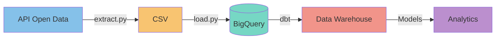

# 🚧 Travaux Angers ELT Pipeline

## 🎯 Vue d'ensemble

Ce pipeline ELT (Extract, Load, Transform) modernise l'analyse des travaux publics de la ville d'Angers. Contrairement à une approche ETL traditionnelle, les transformations sont effectuées directement dans le data warehouse (BigQuery) via dbt, offrant ainsi plus de flexibilité et de puissance pour l'analyse des données.

### Pourquoi ELT ?
- **Transformation dans le warehouse** : Utilisation de la puissance de calcul de BigQuery
- **Flexibilité accrue** : Modification des transformations sans recharger les données
- **Traçabilité** : Historique complet des données brutes
- **Reproductibilité** : Transformations versionnées avec dbt

### Objectifs du Projet
- Suivre en temps réel l'évolution des chantiers
- Analyser l'impact des travaux sur différentes zones
- Identifier les tendances et patterns des chantiers
- Optimiser la planification des futurs travaux
- Améliorer la communication auprès des citoyens

### Analyses Clés
1. **Distribution Géographique**
   - Carte de chaleur des zones de travaux
   - Identification des quartiers les plus impactés
   - Analyse de la concentration des chantiers

2. **Analyse Temporelle**
   - Durée moyenne des chantiers par type
   - Saisonnalité des travaux
   - Prédiction des périodes de forte activité

3. **Impact et Performance**
   - Suivi du respect des délais
   - Analyse des retards et leurs causes
   - Évaluation de l'efficacité des travaux

4. **Indicateurs Stratégiques**
   - Taux d'occupation de la voirie
   - Densité des travaux par zone
   - Impact sur la circulation

## 🏗️ Architecture



## 🛠️ Technologies Utilisées

- **Python** : Scripts d'extraction et chargement
- **Google BigQuery** : Data Warehouse
- **dbt** : Transformation et modélisation des données
- **Git & GitHub** : Versionning et partage de code
- **Cron** : Orchestration des tâches

## 📊 Structure des Données

### Pipeline de Données
1. **Extraction (E)**
   - Collecte via l'API Open Data d'Angers
   - Stockage au format CSV

2. **Chargement (L)**
   - Import dans BigQuery
   - Historisation des données

3. **Transformation (T)**
   - Modélisation en couches (Bronze/Silver/Gold)
   - Calculs des métriques
   - Agrégations temporelles

### Modèles dbt

#### Bronze (Raw)
- `src_travaux_angers` : Données brutes historisées
  - Coordonnées géographiques
  - Dates de début/fin
  - Types de travaux
  - Descriptions et impacts

#### Silver (Staging)
- `stg_travaux_angers` : Données standardisées
  - Normalisation des types
  - Calcul des durées
  - Enrichissement géographique

#### Gold (Business)
- `dim_travaux_details` : Détails enrichis des chantiers
  - Classification des impacts
  - Métriques de durée
  - Informations géographiques

- `fct_travaux_stats` : KPIs globaux
  - Nombre de chantiers actifs
  - Taux d'occupation
  - Métriques d'impact

- `fct_travaux_stats_daily` : Analyses journalières
  - Évolution quotidienne
  - Nouveaux chantiers
  - Taux de complétion

- `fct_travaux_stats_monthly` : Synthèse mensuelle
  - Tendances mensuelles
  - Comparaisons année/année
  - Prévisions

## 🚀 Installation

1. Cloner le repository
```bash
git clone https://github.com/votre-nom/travaux-angers-etl.git
cd travaux-angers-etl
```

2. Installer les dépendances
```bash
pip install -r requirements.txt
```

3. Installer les packages dbt
```bash
cd dbt
dbt deps
```

## 📈 Usage

### Pipeline ELT Complet
```bash
python run_etl.py
```

### Commandes Individuelles

#### Extraction des données
```bash
python extract.py
```

#### Chargement dans BigQuery
```bash
python load.py
```

#### Transformations dbt
```bash
cd dbt
dbt run
```

## 📋 Tests

```bash
# Tests dbt
cd dbt
dbt test
```


